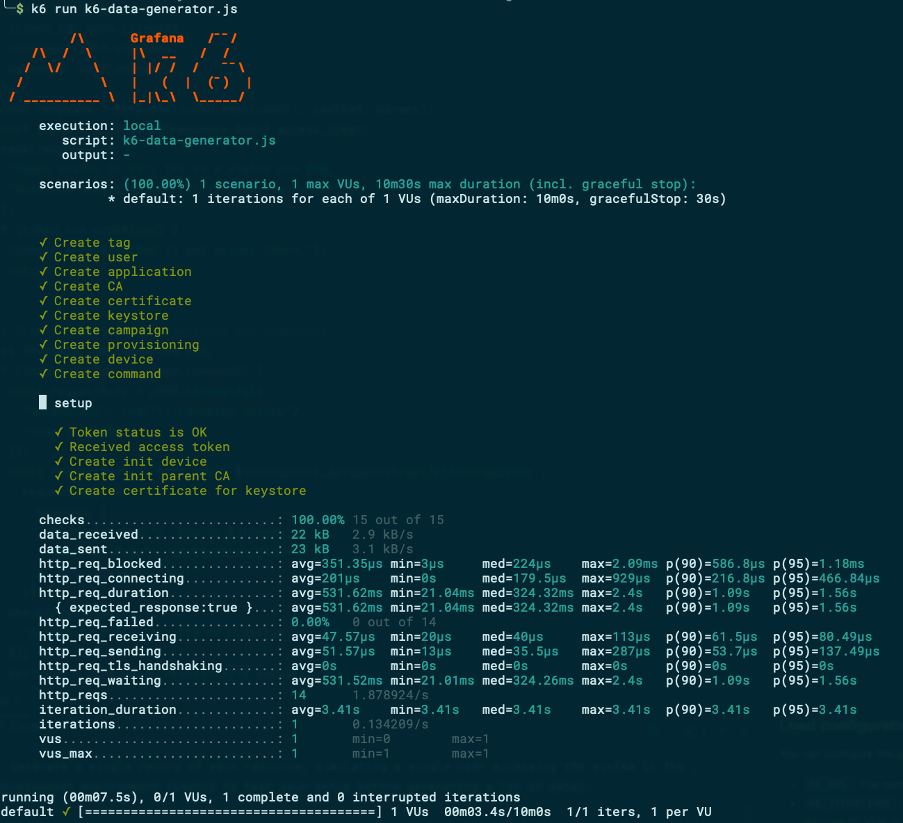

# esthesis CORE - Data generator

This is a data generator script for the esthesis CORE project. It generates random data for, pretty
much, all the entities in the project. It uses [K6](https://k6.io) as a runner.

## Configuration

### Authentication
You need to provide the following environment variables to authenticate with the esthesis CORE:
- `K6_ESTHESIS_CORE_KEYCLOAK_URL`: The URL of the Keycloak server, pointing to the realm's OIDC
token URL.
- `K6_ESTHESIS_CORE_CLIENT_ID`: The client ID to use to authenticate with the Keycloak server.
- `K6_ESTHESIS_CORE_USERNAME`: The username to use to authenticate with the Keycloak server.
- `K6_ESTHESIS_CORE_PASSWORD`: The password to use to authenticate with the Keycloak server.

Note: Those variables are already set for the development environment, so you don't need to set them.

### Service URLs
You need to provide the following environment variables to point to the esthesis CORE services:
- `K6_ESTHESIS_CORE_TAG_SRV`: The URL of the tags service.
- `K6_ESTHESIS_CORE_SECURITY_SRV`: The URL of the security service.
- `K6_ESTHESIS_CORE_APPLICATION_SRV`: The URL of the application service.
- `K6_ESTHESIS_CORE_CRYPTO_SRV`: The URL of the crypto service.
- `K6_ESTHESIS_CORE_CAMPAIGN_SRV`: The URL of the campaign service.
- `K6_ESTHESIS_CORE_PROVISIONING_SRV`: The URL of the provisioning service.
- `K6_ESTHESIS_CORE_DEVICE_SRV`: The URL of the device service.
- `K6_ESTHESIS_CORE_COMMAND_SRV`: The URL of the command service.

Note: Those variables are already set for the development environment, so you don't need to set them.

### Load configuration
You can configure the generated load by setting the following environment variables:
- `K6_VUS`: The number of virtual users (VUs) to simulate. This is the number of parallel requests sent to the system.
- `K6_ITERATIONS`: The number of iterations to run for each VU. This is the total number of requests to be sent to the system (note, this is irrespective of the number of VUs, i.e. if you have 1000 iterations, regardles of whether you use 10 VUs or 1 VU, you will still end up with 1000 new records).
- `K6_DURATION`: The maximum duration of running time for the script. If the script takes longer than this value, it will be stopped. The format is a string with a number followed by a time unit (e.g. `10s` for 10 seconds, `1m` for 1 minute, `1h` for 1 hour).

## Running time

In modern hardware, generating 100000 records of any resource takes approximately 4-5 minutes each. However, resources involving generating public keys, private keys, certificates, or certificate authorities take considerably longer. Make sure you adjust `K6_DURATION` accordingly, so that your script is not cut short.

## Examples

1. Generate a single record of each resource, simulating a single user accessing the system in the development environment (useful to test your setup before generating a lot of data):

	```Bash
	k6 run k6-data-generator.js
	```

2. Create 100000 records of each project resource, simulating 10 parallel users accessing the system in the development environment:

	```Bash
	K6_DURATION=8h K6_ITERATIONS=100000 K6_VUS=10 k6 run k6-data-generator.js
	```

## Sample output

