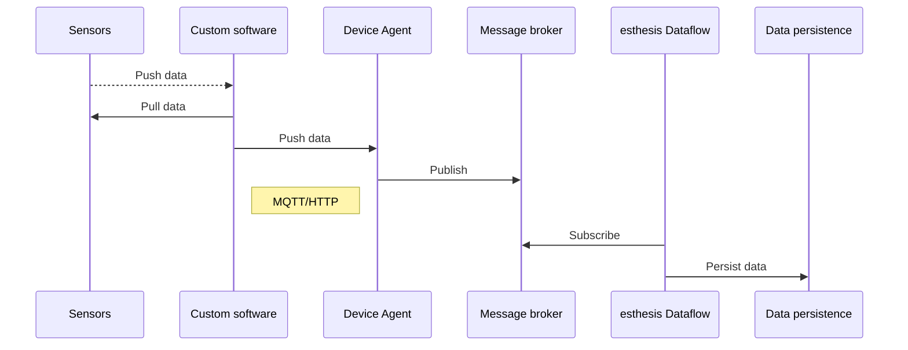

# esthesis device agent

The esthesis CORE device agent is the piece of software that runs in your devices allowing you to
seamlessly connect and control them from _esthesis_ platform. The device agent is available both
as a Docker container supporting multiple architectures, as well as a standalone executable built
for different platforms and Operating Systems.

Please note that the device agent itself is not capable of connecting to your own sensors, actuators,
etc. Its purpose is to provide the necessary communication infrastructure for your devices to connect
to esthesis CORE. You must gather your data using your own software and then send it to the device agent.
The following figure presents a high-level overview of this process:

In the following sections you find out how to install the device agent into your devices, how to configure it and 
connect it to esthesis CORE, as well as how to send data from your devices to the platform and vice versa.