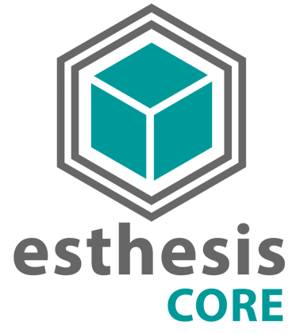

# esthesis CORE

esthesis CORE is the central hub of the esthesis IoT platform, responsible for managing, analysing, and storing 
aggregated data from multiple edge or standalone/agent-based deployments. It acts as a centralised data 
repository and processing engine, providing a unified view of the data collected from various edge 
deployments.

esthesis CORE provides a flexible data management architecture, using pluggable modules around a Kafka message
broker. This architecture allows for easy integration with third-party systems, and we already provide several
modules to support common use cases, such as time-series databases, relational databases, redis, and more.

Key features of esthesis EDGE include:

1. **Dashboards**: Rich, real-time dashboard functionality with more than 15 widgets to visualise data.
2. **Device management**: Remote devices registration, configuration, and management.
3. **Command and Control**: Remotely control devices by send commands, and receiving responses.
4. **Provisioning**: Manual or automated device firmware provisioning and onboarding.
5. **Campaigns**: Schedule and manage tasks to push configurations or firmware updates to devices,
using sophisticated workflows, conditions, triggers, and reporting.
6. **Certificates, CAs, and Keystores**: Manage device certificates, create custom certificate authorities, 
and export keystores.
7. **Data pipelines**: Fully customisable data processing pipelines with ready-made modules, or easily integrate your own.
8. **Infrastructure management**: Register supporting infrastructure, such as an MQTT server, and intelligently assign
devices to the best available infrastructure.
9. **Digital Twins**: Create digital twin applications of devices, and monitor and control the devices in real-time via
an intuitive REST API.
10. **Tagging**: Organise devices into groups using tags, and apply configurations, firmware updates, or 
send commands based on tags.
11. **Security**: Manage your users, roles, and permissions, using a flexible and granular permission model.
12. **Auditing**: Track all user actions, and monitor the system for security and compliance.
