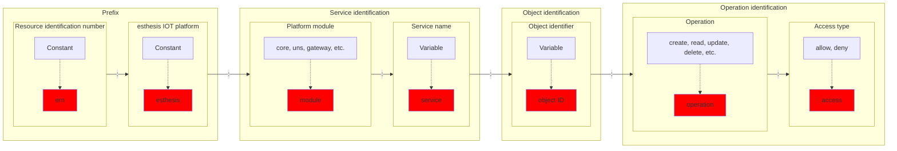

# Permissions and Security

esthesis Core secures access to resources via a permissions system. This system is based on the
Policies model, which is a set of rules that are evaluated to determine whether a user has access
to a resource.

A policy template contains the following parts:



An example policy could be:

```text
ern:esthesis:core:ca:*:delete:allow
```

The above policy allows the deletion of any resources in the Certificate Authoridy service of the
esthesis Core module.

## Backend
