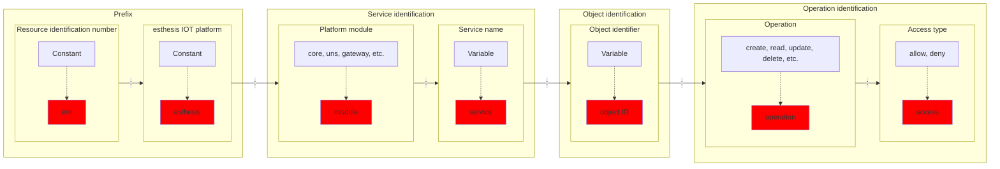

# Permissions and Security

esthesis Core secures access to resources via a permissions system. This system is based on the
Policies model, which is a set of rules that are evaluated to determine whether a user has access
to a resource.

A policy template contains the following parts:



An example policy could be:

```text
ern:esthesis:core:ca:*:delete:allow
```

The above policy allows the deletion of any resources in the Certificate Authoridy service of the
esthesis Core module.

## Backend integration
You can perform manual security checks using the `isPermitted` method in the `SecurityPermissionsService`
class (or respectively via the `SecurityResource` client). There are two variations of this method,
one that checks the category and the operation that you want to check, and a similar one that also
takes into account a specific resource id. The method returns a boolean value that indicates whether
the user has the required permissions or not. For example:
```java
if (!securityResource.isPermitted(TAG, Operation.DELETE, id)) {
   throw new QSecurityException("You are not allowed to delete this tag.");
} else {
   return super.deleteById(id);
}
```

Manually checking for permissions can be helpful in cases where you need to evaluate a more complex
logic than just "can user X perform operation Y", however, for most other cases it is indeed that
simple security check the only thing you need to perform. To facilitate scenarios such as this, we
have created the `ErnPermission` annotation. For example:
```java
@ErnPermission(category = TAG, operation = DELETE)
```

`@ErnPermission` provides two additional features you should be aware of:
1. `bypassForRoles` parameter allows you to define a list of roles that are allowed to bypass the
	permission check. This is useful for cases where you want to allow certain roles to perform an
	operation regardless of the permissions, for example, system actions.
2. `checkResourceId` parameter allows you to define whether a specific resource check should be
	performed or skipped. By default, this is set to `true`, meaning that the permission check will
	always try to figure out if you are accessing a specific resource and try to explicitly check
	permissions for that resource. If you set this to `false`, the permission check will only check
	permissions for the category and operation, without taking into account the resource id. The way
	in which resource id discovery takes place is by inspecting the first argument of the method
	annotated with `@ErnPermission`. If the argument is of type `String`, it will be considered as
	the resource id; similarly, if the argument is of type `BaseEntity`, its `getId()` method will be
	invoked to get the resource id. In case you have a method that e.g. has a single argument of type
	`String` but that argument is not a resource id, you can set the `checkResourceId` parameter to
	`false` and the permission check will not try to extract the resource id from the method argument.

### Placement
On top of the permission system, all endpoints of the application are secured by OIDC. That
effectively means that you need to carefully place security checks and annotations in appropriate
places in the code. As a rule of thumb you can go by the following guidelines:
1. If you are working with the implementation of the client of a service, e.g. `TagResourceImpl`,
	annotate all endpoints with `@RolesAllowed`. This will ensure that the endpoint is secured by
	OIDC and that only users with the required roles can access it.
2. If you are working with the implementation of the service itself, e.g. `TagService`, annotate
	all methods that need to be secured with `@ErnPermission`. This will ensure that the method is
	secured by the permission system and that only users with the required permissions can access it.

## Frontend integration
Security and permissions can also be checked on the frontend side allowing to show, hide, or disable
certain UI elements based on the user's permissions. Note that frontend permissions checks are only
used for UI purposes and should not be used as a security measure; you should always secure your
backend endpoints as well as described above.

The security policies associated with the currently logged-in user are fetched during login and
stored in the browser's session storage under the key `X-ESTHESIS-PERMISSIONS`. That effectively
means that if you change policies for a user, they will need to log out and log back in to see the
changes (or just refreshing their browser); backend security checks are automatically updated.

In your frontend code you do not need to directly access the session storage, as there are helper
methods available. Here is how you can check for permissions in your frontend code:
1. Have your Angular component extending the `SecurityBaseComponent` class. `SecurityBaseComponent`
provides several variations of an `isPermitted` method that you can use to check for permissions, but
also performs automatic permission evaluations exposing the following instance variables:
   - `allowRead`: Indicating whether the user is allowed to read the resource.
   - `allowCreate`: Indicating whether the user is allowed to create the resource.
   - `allowWrite`: Indicating whether the user is allowed to edit the resource.
   - `allowDelete`: Indicating whether the user is allowed to delete the resource.
2. Have your Angular component's constructor call its parent constructor passing the correct
category and resource id - if applicable.

Once you have properly initialised your Angular component, you can influence how the UI should be
rendered based on the user's permissions. For example:
```html
<button (click)="delete()"
        *ngIf="allowDelete && id !== appConstants.NEW_RECORD_ID"
        class="btn btn-sm btn-accent">DELETE
</button>
```
or
```html
<button (click)="save()"
        *ngIf="allowCreate || allowWrite" [disabled]="form.invalid"
        class="btn btn-sm btn-primary">SAVE
</button>
```

### Hide or disable?
When deciding whether to hide or disable a UI element based on the user's permissions, you should
consider the following:
- If the user is not allowed to perform an action, you should hide the UI element. This is because
	disabling the element can be confusing to the user, as they might not understand why they cannot
	perform the action.
- If the user is allowed to perform an action but the action is currently not available, you should
	disable the UI element. This is because the user should be able to see that the action is possible,
	but that they cannot perform it at the moment.
