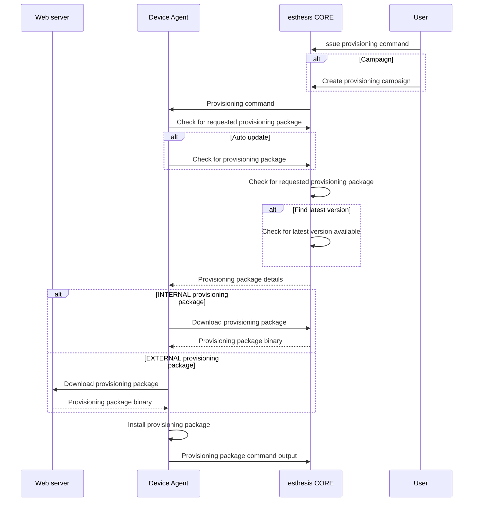

# Provisioning

Provisioning can be executed in two ways:
- By issuing a command to the device from the platform, or
- By the device itself as part of its auto-update mechanism.

Regardless of which way provisioning is initiated, the underlying mechanism is the same. In the
following sections we present the differences in the initiation mechanism and then proceed analysing
the common provisioning mechanism.

## Provisioning initiation
### Platform initiated provisioning
The platform can initiate device provisioning via commands or campaigns. Both functionalities allow
the platform to send a message to the device, which will trigger the provisioning process. In case
of a command, a command of type `firmware` is created which can optionally specify a specific
provisioning package version to be installed. Similarly, a campaign of type `provisioning` can be used to
achieve similar results.

### Device initiated provisioning
The device agent can be configured to periodically check for new provisioning package versions. If a
new version is found, the device will download and install it. This process is called auto-update.
The underlying implementation of this functionality is the same as a platform-initiated provisioning
when not specifying a specific firmware version.

## Provisioning package selection
The provisioning package can be selected in two ways:
- Specific version selection: A specific version of a provisioning package is requested. If the package exists, it gets downloaded and the provisioning process is initiated.
- Latest version selection: The latest version of a provisioning package is requested. esthesis CORE uses semantic versioning to determine what the next version should be based on the current version of the device. For this method to work, the device should be able to report its local version.

## Provisioning flow
The following diagram depicts the provisioning flow. For simplicity, the MQTT server between the Device Agent and esthesis CORE platform is omitted.

## Provisioning security
As depicted above, the provisioning process is a two-part process: First, the device asks for the
details of the provisioning package, then, the device downloads and installs the package. Both
mechanisms can be secured as presented next.

### Querying for provisioning packages
Querying for provisioning packages is a publicly accessible endpoint, so devices can query it from
anywhere. To secure this endpoint, the querying endpoint incorporates a simple token validation
mechanism (this option can be disabled in application settings).

The token to be sent together with a provisioning package query request consists of the device's
hardware id signed by the device's secret key. esthesis CORE validates the token by checking the
signature of the hardware id with the device's public key.

### Downloading provisioning packages
Provisioning packages hosted in esthesis CORE (i.e. INTERNAL type) are served directly by esthesis
CORE to devices. To prevent unauthorized access to the provisioning packages, the download link
presented to the devices as part of the provisioning package querying process incorporates a unique,
random token. As a result, the download link is only valid for a single download and cannot be reused.

### Request limits
Querying for provisioning package is rate limited to a total of 5 request in 5 minutes. The rate
limit is currently hardcoded into the code - may the need arise, it can be provided as a configurable
option in the future.

The validity of the download token can be set in the application settings. The default value is 60
minutes.
