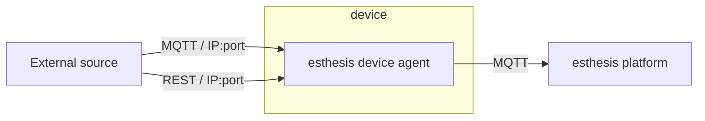
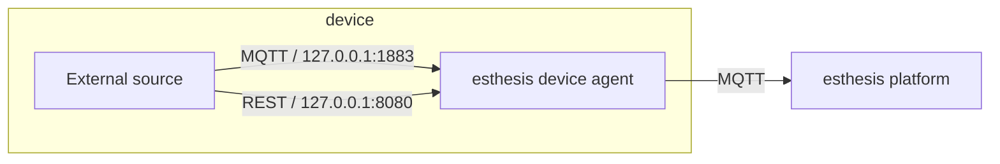

# Embedded endpoints

esthesis device agent comes with two embedded endpoints:
- An MQTT endpoint, allowing external applications to communicate with the device agent using MQTT, and
- An HTTP/REST endpoint, allowing external applications to communicate with the device agent using HTTP.

:::tip
Both endpoints are off by default, so you need to enable them in the
[configuration options](02-Configuration%20parameters.md) before you can use them.
:::

The purpose of the embedded endpoints is to allow external sources to forward data to the esthesis
platform. Since the endpoints are defined and configured on the esthesis device agent, external
sources can forward data to the esthesis platform without having to be aware of any connectivity
details, other than the IP address and port of the endpoints on the esthesis device agent.





As depicted above, in the case where the external source is running on the same device as the
esthesis device agent, the external source can be configured to use `127.0.0.1`.

:::caution
The embedded endpoints do not support security, i.e. they do not support authentication. If you
make your endpoints accessible to other devices in your network, make sure you do so in a controlled
environment. Alternatively, if your external source is running on the same device as the esthesis
device agent, you can have the embedded endpoints only listen to `127.0.0.1` (which is the default
value).
:::

Both embedded endpoints expect data to follow the
[esthesis Line Protocol](../07-References/01-esthesis-line-protocol.md), however you can push any
other format you may have and convert it into the esthesis Line Protocol using the
[Transforming payloads](05-Transforming%20payloads.md) functionality of the agent.

## HTTP endpoints
esthesis device agent exposes two HTTP endpoints:
- `/telemetry` - for sending telemetry data to the esthesis platform, and
- `/metadata` - for sending metadata to the esthesis platform.

:::info
The HTTP endpoints are off by default, so you need to enable them first using the `ENDPOINT_HTTP`
environment variable, or the `endpointHttp` command line argument.
:::

### Sending data example
```shell
curl -X POST 127.0.0.1:8080/telemetry -d "cpu temperature=30"
```
```shell
curl -X POST 127.0.0.1:8080/metadata -d "net ip='192.168.1.1'"
```


:::tip
The above example considers the esthesis device agent being accessible at 127.0.0.1 IP address.
This is fine if you execute the `curl` command on the same device as the esthesis device agent. If
you execute the `curl` command from a different device, you need to replace the IP address with the
IP address of the device where the esthesis device agent is running and configure the esthesis device
agent to listen to that IP address via the `ENDPOINT_HTTP_LISTENING_IP` environment variable, or the
`endpointHttpListeningIP` command line argument.
:::

## MQTT endpoint
esthesis device agent exposes two MQTT endpoints:
- `telemetry` - for sending telemetry data to the esthesis platform, and
- `metadata` - for sending metadata to the esthesis platform.

:::info
The MQTT endpoints are off by default, so you need to enable them first using the `ENDPOINT_MQTT`
environment variable, or the `endpointMqtt` command line argument.
:::

### Sending data example
To send data to the MQTT endpoints you need to use an MQTT client. The following examples use the
[Mosquitto MQTT client](https://mosquitto.org), which is available for most operating systems.

```shell
mosquitto_pub -h 127.0.0.1 -t telemetry -m "cpu temperature=20"
```

```shell
mosquitto_pub -h 127.0.0.1 -t metadata -m "net ip='192.168.1.2'"
```

:::tip
The above example considers the esthesis device agent being accessible at 127.0.0.1 IP address.
This is fine if you execute the `mosquitto_pub` command on the same device as the esthesis device agent. If
you execute the `mosquitto_pub` command from a different device, you need to replace the IP address with the
IP address of the device where the esthesis device agent is running and configure the esthesis device
agent to listen to that IP address via the `ENDPOINT_MQTT_LISTENING_IP` environment variable, or the
`endpointMqttListeningIP` command line argument.
:::
