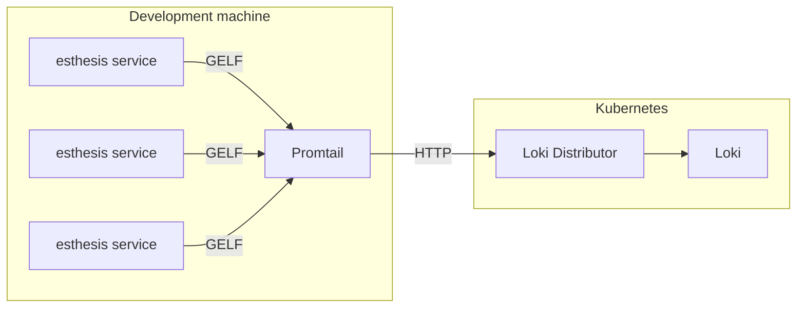

# Observability

esthesis CORE supports integration with distributed tracing, real-time metrics, and centralised
logging.

## Traces
Tracing is taking place using Quarkus' [OpenTelemetry](https://quarkus.io/guides/opentelemetry)
integration. There are no special source code actions required to enable tracing,
other than properly configuring traces in `application.yaml`and`application-dev.yaml` files inside
each module. Note that tracing is disabled by default when a module runs in production, and enabled
by default when a module runs in development.

Quarkus exports traces using OTel gRPC. In the default development setup, traces are received by
Grafana Loki Distributor at port 4317. The distributor is also listening on port 55681 for OTel HTTP
traces (notably, used by APISIX).

To store and visualise traces we use [Grafana Tempo](https://grafana.com/oss/tempo). In our default development setup it is
available at [Grafana UI](http://grafana.esthesis) > Explore > Tempo.

## Logging
Centralised logging is implemented using Quarkus Logging Gelf. All modules export Graylog Extended
Log Format (GELF) messages that can be captured by a GELF receiver. In the default development
setup, GELF messages are received by Grafana Promtail running on the development machine, which then
forwards them to a Grafana Loki Distributor running on Kubernetes. When you test a production-like
installation, there is a Promtail running inside Kubernetes.

Unfortunately, we can not provide a Promtail running in Kubernetes for development as Quarkus Logging
Gelf component only supports forwarding logs using UDP. UDP port-forwarding is not (yet) supported
in Kubernetes, and alternative setups to expose a UDP port are too complex for a development setup.
Therefore, for your development setup you run something like the following:

You can find how to run Promtail locally in the [Dev Environment setup](01-Dev%20Environment%20setup.md) page.

## Metrics
Metrics are exported using Quarkus' [Micrometer](https://quarkus.io/guides/micrometer) integration.
You can access the metrics under `/q/metrics` endpoint of each module.
