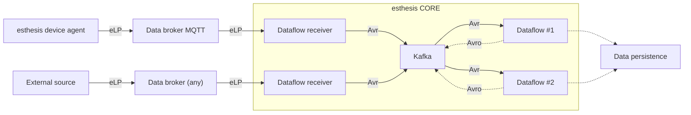

# Avro support

## Introduction
[Apache Avro](https://avro.apache.org) is a widely used data serialization system developed by the Apache Software Foundation.
It provides a compact, fast, and schema-based format for data exchange between different components
of distributed systems. Avro focuses on efficient data storage and transmission, making it suitable
for use cases where performance and interoperability are critical.

At its core, Avro uses a schema to define the structure of the data. The schema describes the fields,
their types, and the relationships between them. Avro schemas are defined using JSON, which makes
them easy to read, write, and interpret by different programming languages.

Avro data is serialized in a binary format, which results in compact data representation and
efficient storage. This binary format enables fast serialization and deserialization, making Avro
suitable for high-performance applications and systems with stringent latency requirements.

## Design
esthesis communicates with external sources using the
[esthesis Line Protocol](01-esthesis-line-protocol.md) (eLP). eLP is a simple protocol,
human-readable, which can be manipulated very easily with rudimentary programming effort and resources.
It is therefore a convenient protocol for devices with limited resources.

However, being a text-based protocol, it is not the most efficient way to use when data has already
arrived at esthesis and needs to be further processed by the various Dataflow components of esthesis
Core. For this reason, esthesis CORE supports internally the [Avro](https://avro.apache.org/)
data serialization.

Here is how it works:



As depicted above, external data sources send data to a data broker using eLP. The esthesis device agent
is using MQTT, however other custom external data sources may choose to use any other protocol, provided
a dataflow is available to receive the data.

Once the data is received by the dataflow receiver, it is processed using eLP and then converted to Avro.
The converter Avro data is then sent to a Kafka topic, where it is available for further processing by
other dataflow components.

In case a dataflow component needs to put a processed message back to Kafka for another dataflow
to pick it up, it is also using Avro.

## Specification
esthesis uses three different Avro schemas as presented next.
### esthesis Data Message
The Avro schema used to serialize data received from external sources. It is defined in [esthesis-data-message.avsc](https://github.com/esthesis-iot/esthesis-platform/blob/main/esthesis-core/esthesis-core-backend/avro/src/main/avro/esthesis-data-message.avsc) file.
<details>
<summary>AVSC</summary>

```json
{
  "type": "record",
  "name": "EsthesisDataMessage",
  "namespace": "esthesis.avro",
  "fields": [
    {
      "name": "id",
      "type": "string",
      "doc": "The unique identifier for this message"
    },
    {
      "name": "correlationId",
      "type": [
        "null",
        "string"
      ],
      "default": null,
      "doc": "The id of the message that this message is a response to"
    },
    {
      "name": "hardwareId",
      "type": "string",
      "doc": "The hardware id of the device that sent the message"
    },
    {
      "name": "seenBy",
      "type": "string",
      "doc": "A text describing the component that originally constructed this message"
    },
    {
      "name": "seenAt",
      "type": [
        "null",
        "string"
      ],
      "default": null,
      "doc": "A timestamp in ISO-8601 format, created by the first component that received this message"
    },
    {
      "name": "type",
      "type": {
        "name": "MessageTypeEnum",
        "type": "enum",
        "symbols": [
          // PING
          "P",
          // TELEMETRY
          "T",
          // METADATA
          "M"
        ],
        "doc": "P = Ping, T = Telemetry, M = Metadata"
      }
    },
    {
      "name": "channel",
      "type": "string",
      "doc": "The channel that the message was received on."
    },
    {
      "name": "payload",
      "type": {
        "type": "record",
        "name": "PayloadData",
        "fields": [
          {
            "name": "category",
            "type": "string",
            "doc": "The category of the values being submitted"
          },
          {
            "name": "timestamp",
            "type": [
              "null",
              "string"
            ],
            "default": null,
            "doc": "A timestamp in ISO-8601 format pertaining to the values submitted"
          },
          {
            "name": "values",
            "type": {
              "type": "array",
              "items": {
                "type": "record",
                "name": "ValueData",
                "fields": [
                  {
                    "name": "name",
                    "type": "string",
                    "doc": "The name of the key for this value"
                  },
                  {
                    "name": "value",
                    "type": "string",
                    "doc": "The value for this key"
                  },
                  {
                    "name": "valueType",
                    "type": {
                      "name": "ValueTypeEnum",
                      "type": "enum",
                      "symbols": [
                        "STRING",
                        "BOOLEAN",
                        "BYTE",
                        "SHORT",
                        "INTEGER",
                        "LONG",
                        "BIG_INTEGER",
                        "FLOAT",
                        "DOUBLE",
                        "BIG_DECIMAL",
                        "UNKNOWN"
                      ],
                    "doc": "You can provide hints in the esthesis Line Protocol regarding the type of this value, otherwise a best-effort automatic detection will take place"
                    }
                  }
                ]
              }
            }
          }
        ]
      }
    }
  ]
}
```
</details>

### esthesis Command Request Message
The Avro schema used to serialize command request messages. It is defined in [esthesis-command-request-message.avsc](https://github.com/esthesis-iot/esthesis-platform/blob/main/esthesis-core/esthesis-core-backend/avro/src/main/avro/esthesis-command-request-message.avsc) file.
<details>
<summary>AVSC</summary>

```json
{
  "type": "record",
  "name": "EsthesisCommandRequestMessage",
  "namespace": "esthesis.avro",
  "fields": [
    {
      "name": "id",
      "type": "string",
      "doc": "The unique identifier for this message"
    },
    {
      "name": "hardwareId",
      "type": "string",
      "doc": "The hardware id of the device that sent the message"
    },
    {
      "name": "commandType",
      "type": {
        "name": "CommandType",
        "type": "enum",
        "symbols": [
          // Execute command
          "e",
          // Firmware update
          "f",
          // Reboot
          "r",
          // Shutdown
          "s",
          // Ping
          "p",
          // Health report
          "h"
        ],
        "doc": "The type of the command to execute, 'e' for execute, 'f' for firmware update, 'r' for reboot, 's' for shutdown, 'p' for ping, 'h' for health report."
      }
    },
    {
      "name": "executionType",
      "type": {
        "name": "ExecutionType",
        "type": "enum",
        "symbols": [
          // Asynchronous execution
          "a",
          // Synchronous execution
          "s"
        ],
        "doc": "The execution type of the command to be executed, 'a' for asynchronous, 's' for synchronous."
      }
    },
    {
      "name": "command",
      "type": "string",
      "doc": "The command to execute"
    },
    {
      "name": "arguments",
      "type": [
        "null",
        "string"
      ],
      "default": null,
      "doc": "The command arguments to pass to the command to be executed"
    },
    {
      "name": "createdAt",
      "type": "string",
      "doc": "A timestamp in ISO-8601 format"
    }
  ]
}

```
</details>

### esthesis Command Reply Message
The Avro schema used to serialize command reply messages. It is defined in [esthesis-command-reply-message.avsc](https://github.com/esthesis-iot/esthesis-platform/blob/main/esthesis-core/esthesis-core-backend/avro/src/main/avro/esthesis-command-reply-message.avsc) file.
<details>
<summary>AVSC</summary>

```json
{
  "type": "record",
  "name": "EsthesisCommandReplyMessage",
  "namespace": "esthesis.avro",
  "fields": [
    {
      "name": "id",
      "type": "string",
      "doc": "The unique identifier for this message"
    },
    {
      "name": "correlationId",
      "type": [
        "null",
        "string"
      ],
      "default": null,
      "doc": "The id of the message that this message is a response to"
    },
    {
      "name": "hardwareId",
      "type": "string",
      "doc": "The hardware id of the device that sent the message"
    },
    {
      "name": "seenBy",
      "type": "string",
      "doc": "A text describing the component that originally constructed this message"
    },
    {
      "name": "seenAt",
      "type": [
        "null",
        "string"
      ],
      "default": null,
      "doc": "A timestamp in ISO-8601 format, created by the first component that received this message"
    },
    {
      "name": "type",
      "type": {
        "name": "ReplyType",
        "type": "enum",
        "symbols": [
          // Success
          "s",
          // Failure
          "f"
        ],
        "doc": "s = Success reply, f = Failure reply"
      }
    },
    {
      "name": "channel",
      "type": [
        "null",
        "string"
      ],
      "default": null,
      "doc": "The channel that the message was received on."
    },
    {
      "name": "payload",
      "type": "string",
      "doc": "The payload of the message"
    }
  ]
}
```
</details>

## Helpers
There is an eLP to Avro helper that we are using in our Dataflows, available in [AvroUtils](https://github.com/esthesis-iot/esthesis-platform/blob/main/esthesis-core/esthesis-core-backend/avro/src/main/java/esthesis/avro/util/AvroUtils.java).
If you are creating a new Dataflow, you can use this helper to convert eLP to Avro to save you some time.
