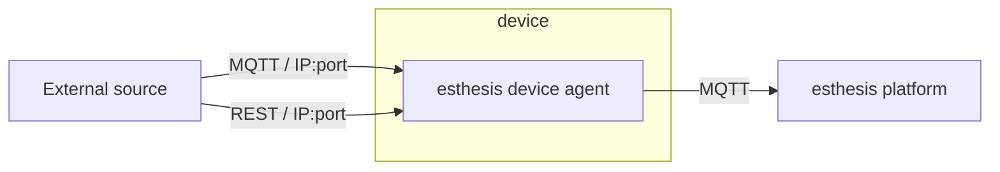
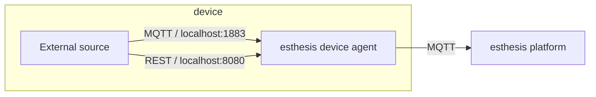

# Embedded endpoints

esthesis device agent comes with two embedded endpoints:
- An MQTT endpoint, allowing external applications to communicate with the device agent using MQTT, and
- A REST endpoint, allowing external applications to communicate with the device agent using REST.

:::tip
Both endpoints are off by default, so you need to enable them in the
[configuration options](02-Configuration%20parameters.md) before you can use them.
:::

The purpose of the embedded endpoints is to allow external sources to forward data to the esthesis
platform. Since the endpoints are defined and configured on the esthesis device agent, external
sources can forward data to the esthesis platform without having to be aware of any connectivity
details, other than the IP address and port of the endpoints on the esthesis device agent.

As depicted above, in the case where the external source is running on the same device as the esthesis device agent, the external source can just be configured to use `localhost`.

:::caution
The embedded endpoints do not support security, i.e. they do not support authentication. If you
make your endpoints accessible to other devices in your network, make sure you do so in a controlled
environment. Alternatively, if your external source is running on the same device as the esthesis
device agent, you can have the embedded endpoints only listen to `127.0.0.1` (which is the default
value).
:::

## REST endpoint
