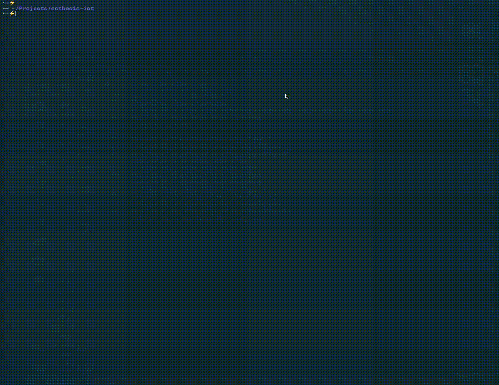

# esthesis - Development environment setup

## Prerequisites

This document describes how to set up a dev environment for esthesis. You need to have access
to the following resources:

- A Kubernetes cluster. This can be something
  like [minikube](https://kubernetes.io/docs/tasks/tools/install-minikube/),
  or [Rancher Desktop](https://rancherdesktop.io),
  or [Docker Desktop](https://www.docker.com/products/docker-desktop/)
  with Kubernetes enabled.
- A Load Balancer capable of handing IP addresses to services of type LoadBalancer. This
  can be something like [MetalLB](https://metallb.universe.tf/). This little addition to your
  dev cluster will allow you to quickly expose services for remote access (i.e. from your
  development machine), without having to port-forward each one of them. As there are plenty of
  services used in our dev environment, MetalLB is highly recommended. You can install MetalLB as
  follows:

  ```bash
  helm repo add metallb https://metallb.github.io/metallb

  helm install metallb metallb/metallb

  cat <<EOF | kubectl apply -f -
  apiVersion: metallb.io/v1beta1
  kind: IPAddressPool
  metadata:
    name: esthesis-pool
  spec:
    addresses:
    - 192.168.21.1-192.168.21.254
  ---
  apiVersion: metallb.io/v1beta1
  kind: L2Advertisement
  metadata:
    name: esthesis-layer2-advertisement
  spec:
    ipAddressPools:
    - esthesis-pool
  EOF
  ```

Please note, you need to provide an IP range compatible with your local network.

## Tools

You may find the following tools useful while developing for esthesis:

- [Lens](https://k8slens.dev) - A Kubernetes IDE. Lens is a desktop application that makes it
  easy to manage Kubernetes clusters. It is available for Windows, macOS and Linux.
- [KaDeck](https://kadeck.com) - A tool for visualising Kafka topics.
- [MQTTX](https://mqttx.app) - A tool for visualising MQTT topics.
- Since you will be running the frontend as well as all services in your development machine, you
  need a utility allowing you to a/ have multiple shells open in the same application window, b/
  automate the process of openning/running multiple process in batch. Spend some time to configure
  your environment with such a tool as it will save you a lot of time. Some recommendations:
    - For Mac:
        - [iTerm2](https://iterm2.com) - A terminal emulator for macOS that does
          amazing things. It is highly configurable and allows you to have multiple shells open in
          the
          same window.
        - [itomate](https://github.com/kamranahmedse/itomate) - A command line tool for automating
          iTerm2. It allows you to automate the process of opening multiple shells in iTerm2.
          Example:

        - 

    - For Linux: (TBC)
    - For Windows: (TBC - although highly not recommended to develop in Windows)

## Setup architecture

In contrast to a production installation where everything runs inside the Kubernetes cluster, for
your dev setup you will need to run some services in the Kubernetes cluster and some other
services on your local development machine. This will allow you to quickly develop and debug,
without having each time to deploy to Kubernetes to test your changes. Please note, we are aware
that Quarkus supports remote development, however we found this to not be 100% reliable in detecting
changes and reloading the code.

### Frontend to service communication

The esthesis Angular frontend communicates with the services (running on your local development
machine) via APISIX. This is necessary, so that OAuth2 is enforced in order for your services to
have a valid caller/principal. That effectively means that you need to create routes in APISIX that
point back to your development machine for each of esthesis services.

In essence, you implement the following calling sequence:

(Development machine) Angular front-end > (Kubernetes) APISIX > (Development machine) Quarkus
service

APISIX dev routes are automatically created for you as part of the `esthesis` Helm chart
installation in dev mode.

### Service to service communication

Service to service communication takes place directly between the services running on your local
development machine; there is no need to go through APISIX in this case. Quarkus Rest client will
automatically include the JWT token on every request, so the target service you're calling can have
access to it.

## Setup process

Esthesis provides a variety of Helm Charts to cater to the needs of different installation
environments. As a developer, you need access to all possible services to be able to develop and
test across all possible deployment scenarios. Services can be installed using the provided Helm 
charts as presented below.

Please note that some Helm charts will instruct you to update your local `hosts` file. This is to
allow you having easy names when trying to access the remote Kubernetes services on your local
environment. Throughout our development documentation we refer to such services using the
above-suggested friendly names.

### APISIX

```bash
cd esthesis-platform/setup/helm/esthesis-apisix
helm upgrade --install apisix . -f values.yaml -f values-dev.yaml
```

### APISIX Dashboard

```bash
cd esthesis-platform/setup/helm/esthesis-apisix-dashboard
helm upgrade --install apisix-dashboard . -f values.yaml -f values-dev.yaml
```

### Kafka

```bash
cd esthesis-platform/setup/helm/esthesis-kafka
helm upgrade --install kafka . -f values.yaml -f values-dev.yaml
```

### Keycloak

```bash
cd esthesis-platform/setup/helm/esthesis-keycloak
helm upgrade --install keycloak . -f values.yaml -f values-dev.yaml
```

Notes:

- This chart will also create an `esthesis` Keycloak realm and install a PostgreSQL database to
  be used exclusively by Keycloak.
- Once Keycloak is up and running, you need to create a user in `esthesis` realm, via Manage > Users >
  Add user. Once the user is created, navigate to the user's Credentials tab and set a password.
  This is the user you can authenticate with in the frontend. The default administrator user is "esthesis-admin", so it is suggested you start by creating a user with this username.
- You also need to set up a "system" user in Keycloak. This user is used for inter-service
  communication
  when a principal is not established (for example, when an external device is
  registering with esthesis). Similarly to the above step, create a user `esthesis-system` with
  password `esthesis-system`.
- During development, you can set access tokens to expire far in the future, via configuring
  Clients > (esthesis) > Settings > Advanced Settings > Access Token Lifespan.

### MongoDB

```bash
cd esthesis-platform/setup/helm/esthesis-mongodb
helm upgrade --install mongodb . -f values.yaml -f values-dev.yaml
```

Notes:

- The above chart will also create a MongoDB `esthesis` user and a database `esthesis`.
- Liquibase requires `collMod` permission, so `esthesis` user is assigned `dbAdmin`.

### Prometheus

```bash
cd esthesis-platform/setup/helm/esthesis-prometheus
helm upgrade --install prometheus . \
  -f values.yaml -f values-dev.yaml \
  --set global.devEnv.ip=192.168.100.100
```

Notes:

- You need to provide your development machine's IP address above. This is due to the reason that in
  development mode the services will be running locally at your development machine, so Prometheus
  needs to be able to scrape them (during the installation, Prometheus jobs are configured to scrape
  your services by pointing the scrapers to the provided IP address).

### RabbitMQ

```bash
cd esthesis-platform/setup/helm/esthesis-rabbitmq
helm upgrade --install rabbitmq . -f values.yaml -f values-dev.yaml
```

### Grafana Loki

```bash
cd esthesis-platform/setup/helm/esthesis-grafana-loki
helm upgrade --install loki . -f values.yaml -f values-dev.yaml
````

Notes: The above chart will create an instance of Grafana Loki configured with promtail
supporting GELF logs. The chart will also export an endpoint to allow logging clients to push GELF
logs via UDP.

### Jaeger

```bash
cd esthesis-platform/setup/helm/esthesis-jaeger
helm upgrade --install jaeger . -f values.yaml -f values-dev.yaml
````

Notes: The above chart will create an instance of Jaeger UI, as well as a Jaeger collector which you
can use from your applications to push your traces to.

### InfluxDB

```bash
cd esthesis-platform/setup/helm/esthesis-influxdb
helm upgrade --install influxdb . -f values.yaml -f values-dev.yaml
````

Notes: To connect a dataflow to InfluxDB you need to create an access token:

- Login to InfluxDB UI (http://esthesis-dev-influxdb:8086) as 'admin/esthesis'.
- Switch organisation to 'esthesis'.
- Navigate to Load Data > API Tokens.
- Click on 'Generate API Token' and select Read/Write.
- Select the 'esthesis' bucket for both read and write and click 'Save'.
- Click on the generated API token entry to obtain the token.

### MySQL

```bash
cd esthesis-platform/setup/helm/esthesis-mysql
helm upgrade --install mysql . -f values.yaml -f values-dev.yaml
````

### Redis

```bash
cd esthesis-platform/setup/helm/esthesis-redis
helm upgrade --install redis . -f values.yaml -f values-dev.yaml
```

### Kogito

```bash
kubectl apply -f "https://github.com/kiegroup/kogito-operator/releases/download/v1.32.0/kogito-operator.yaml"
cd esthesis-platform/setup/helm/esthesis-redis
helm upgrade --install redis . -f values.yaml -f values-dev.yaml
```

Notes:

- Kogito operator will be installed in `kogito-operator-system` namespace.

### esthesis

```bash
cd esthesis-platform/setup/helm/esthesis
helm upgrade --install esthesis . \
  -f values.yaml -f values-dev.yaml \
  --set global.devEnv.ip=192.168.100.100
````

Notes:

- You need to provide your development machine's IP address above. This is needed to create APISIX
  routes pointing back to your development machine.
- The esthesis Helm chart in dev mode is just a shell to provide various configuration options
  needed in development. No actual services are installed in dev mode (i.e. the services run in your
  development machine).

## Access to services from your development machine

- [APISIX dashboard](http://esthesis-dev-apisix-dashboard)
  ```
  Username: esthesis
  Passowrd: esthesis
  ```

- Kafka
  ```
  esthesis-dev-kafka:9094
  ```

- [Keycloak](http://esthesis-dev-keycloak/admin)
  ```
  Username: esthesis
  Passowrd: esthesis
  ```

- MongoDB
  ```
  mongodb://esthesis-dev-mongodb-0:27017,esthesis-dev-mongodb-1:27017/esthesis
  Username: esthesis
  Passowrd: esthesis
  ```

- [Prometheus](http://esthesis-dev-prometheus:9090)
  ```
  http://esthesis-dev-prometheus:9090
  ```

- [Grafana Loki](http://esthesis-dev-grafana-loki:3000)
  ```
  Username: esthesis
  Passowrd: esthesis
  ```

- [Jaeger](http://esthesis-dev-jaeger-ui)

- InfluxDB

    - Admin Interface:

      [InfluxDB](http://esthesis-dev-influxdb:8086)
      ```
      Username: esthesis
      Passowrd: esthesis
      ```

    - Database:
      ```
      esthesis-dev-influxdb:8088
      ```

## Logging, Tracing, and Metrics

esthesis is instrumented to support distributed logging, global tracing, and metrics.

### Logging

Distributed logging is supported via a Graylog Extended Log Format (GELF) logging appender. The
appender comes from `quarkus-logging-gelf` module and is configured as part of Quarkus' logger
configuration `quarkus.log.handler.gelf.*`. The GELF appender is automatically enabled in dev mode
but needs to be manually enabled for prod. In esthesis' default stack, logs aggregation and
visualisation is provided by [Grafana Loki](https://grafana.com/oss/loki/).

### Tracing

Tracing is enabled throughout esthesis via Quarkus' OpenTelemetry integration
via `quarkus-opentelemetry-exporter-otlp` module. Tracing is automatically enabled in dev profile,
however it needs to be manually enabled for prod via Quarkus' `quarkus.opentelemetry.*`
configuration options. Telemetry traces are captured and visualised in [
Jaeger](https://www.jaegertracing.io/).

### Metrics

Metrics are enabled throughout esthesis via Quarkus' Micrometer integration
via `quarkus-micrometer-registry-prometheus` module. Metrics are automatically enabled in dev
profile, however they need to be manually enabled for prod via Quarkus' `quarkus.micrometer.*`
configuration options. Metrics are captured and visualised in [Prometheus](https://prometheus.io/).
Your application Prometheus metrics can be scraped via the `/q/metrics` endpoint.
